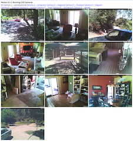

## About

This is add-on for the [Motion package][motionpkg]

It provides for the specification of almost all the configuration [options][motiondoc] for Motion,
including the specification of up to ten cameras.

## Installation

The installation of this add-on is pretty straightforward and not different in
comparison to installing any other Hass.io add-on.

1. [Add our Hass.io add-ons repository][repository] to your Hass.io instance.
1. Install the "Motion" add-on
1. Configure the "Motion" add-on
1. Start the "Motion" add-on
1. Check the logs of the "Motion" add-on for failures :-(
1. Select the "Open WebUI" button to see the cameras output

**Note**: _Remember to SAVE and then restart the add-on when the configuration is changed._

## Configuration

The configuration for this add-on includes configuration for the [Motion package][motionpkg], 
but also for utilization of various services from the IBM Cloud, including [Watson Visual Recognition][watsonvr]

#### Option: `name`

The top-level `name` option controls the identification of the device running the Motion software.
Providing a name will consistently identify the configuration utilized during operation.
Defaults to the HOSTNAME environment from Hass.io.  



#### Options: `username` `password`

The `username` and `password` options are optional, but restrict access to the WebUI.  Specify
a username and password to utilize the WebUI.

#### Option: `fps`

This option specifies the estimate frames-per-second that are processed to create the event GIF animations

#### Option: `mqtt_host` `mqtt_port`

Specify the host and port for sending MQTT messages.  All topics begin with `motion`.

1. `motion/{name}/{camera}` -- JSON payload of motion detected
1. `motion/{name}/{camera}/lost` -- JSON payload of motion detected
1. `motion/{name}/{camera}/event/start` -- JSON payload of motion detected
1. `motion/{name}/{camera}/event/end` -- JSON payload of motion detected
1. `motion/{name}/{camera}/image` -- JPEG payload of image (**see** `post_pictures`)
1. `motion/{name}/{camera}/image-average` -- JPEG payload of average event 
1. `motion/{name}/{camera}/image-blend` -- JPEG payload of blended event (50%)
1. `motion/{name}/{camera}/image-composite` --  JPEG payload of composite event
1. `motion/{name}/{camera}/image-animated` -- GIF payload of event
1. `motion/{name}/{camera}/image-animated-mask` -- GIF payload of event (as B/W mask)

#### Option: `post_pictures`

This specifies if pictures should be posted to MQTT as they are captured (i.e. "on") _or_ if a single picture should be posted for each event.
The value may be "on" to post every picture; "off" to post no pictures; or one of the following:

1. "best" - the picture with movement closest to the center
1. "center" - the center picture (half-way between start and end of event)
1. "first" - the first picture 
1. "last" - the last picture
1. "most" - the picture with the most pixels changed from previous frame

#### Option: `minimum_animate`

The minimum number of images captured during an event that should be animated as a GIF.  Optional.  Default and minimum value is 2.

#### Option: `interval`

The maximum time in seconds that will comprise an event; measured backward from the event of the event.  Optional. Default 0; indicating no maximum.

### Motion Configuration

The Motion package has extensive [documentation][motiondoc] on available parameters.  Almost all parameters are avsailable.
The JSON configuration options are provided using the same name as in the Motion documentation.

For example the Motion parameters for `location_motion_mode` and `location_motion_style` would be indicated in the configuration as follows:

```json
options: {
..
    "locate_motion_mode":"on",
    "locate_motion_style":"box",
..
}
```

#### Option: `cameras`

Motion configuration options are for _all_ cameras, as in the example above.  Each camera must also be defined with a minimum set of characteristics.

Options which can be specified on a per camera basis are:

1. name (string, non-optional)
1. url (string, non-optional)
1. userpass (string, optional; format "user:pass")
1. keepalive (string, optional; valid {"1.1","1.0","force")
1. port (port, optional; will be calculated)
1. quality \[of captured JPEG image\] (int, optional; valid \[0,100); default 80)
1. width (int, optional; default 640)
1. height (int, optional; default 480)
1. rotate (int, optional; valid (0,360); default 0)
1. threshold \[of pixels changed to detect motion\] (int, optional; valid (0,10000); default 5000)
1. models \[for visual recognition\] (string, optional; format "\[wvr|digits\]:modelname,<model2>,..")

## Changelog & Releases

Releases are based on Semantic Versioning, and use the format
of ``MAJOR.MINOR.PATCH``. In a nutshell, the version will be incremented
based on the following:

- ``MAJOR``: Incompatible or major changes.
- ``MINOR``: Backwards-compatible new features and enhancements.
- ``PATCH``: Backwards-compatible bugfixes and package updates.

## Authors & contributors

David C Martin (github@dcmartin.com)

The original setup of this repository is by [Franck Nijhof][frenck].

[commits]: https://github.com/dcmartin/hassio-addons/motion/commits/master
[contributors]: https://github.com/dcmartin/hassio-addons/motion/graphs/contributors
[dcmartin]: https://github.com/dcmartin
[issue]: https://github.com/dcmartin/hassio-addons/motion/issues
[keepchangelog]: http://keepachangelog.com/en/1.0.0/
[releases]: https://github.com/dcmartin/hassio-addons/motion/releases
[repository]: https://github.com/dcmartin/hassio-addons
[motionpkg]: https://motion-project.github.io]
[motiondoc]: https://motion-project.github.io/motion_config.html
[watsonvr]: https://www.ibm.com/watson/services/visual-recognition
[digitsgit]: https://github.com/nvidia/digits
[digits]: https://developer.nvidia.com/digits
